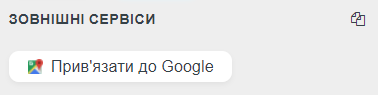

# WME 🇺🇦 E97

Create a small button to copy the address to the clipboard.



## Shortcuts
<table style="width:100%">
<tr>
  <th>Shortcut</th>
  <th>Description</th>
</tr>
<tr>
<td align='center'><code>Ctrl</code>+<code>D</code></td>
<td>Copy the address of the selected POI</td>
</tr>
</table>

## Development

```bash
npm install
npm run build    # single build
npm run watch    # rebuild on changes
```

Source is in `src/`, output is `dist/WME-E97.user.js`.

## Links

Author homepage: https://anton.shevchuk.name/  
Author pet projects: https://hohli.com/  
Support author: https://donate.hohli.com/  
Script homepage: https://github.com/AntonShevchuk/wme-e97/  
GreasyFork: https://greasyfork.org/uk/scripts/391499-wme-e97-copy-address-button/
